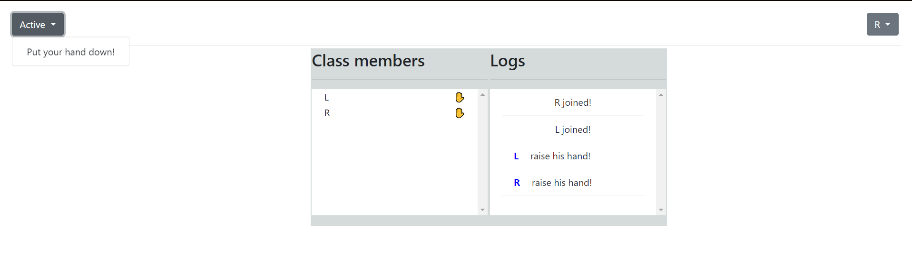
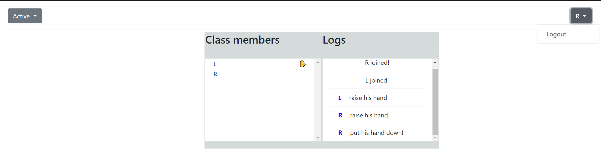

# [VirtualClassroom](https://virtual--classroom.herokuapp.com/)

## Technologies
- Java 8
- Spring Framework 5.x
- Spring Boot 2.1 or higher
- Spring Data
- Swagger
- WebSockets
- Bootstrap, HTML, CSS, JavaScript/JQuery

## Task description 

##### Develop application which presents classroom with students. The students must have the following abilities: 
- login to the class
- logout from the class
- raise their hands up

##### The WebSockets technology must be used for notifying classroom members each time when:
- new student signs in to the class
- the student signs out of the class
- the student raises his hand up or down

##### It means that members list on Members screen must be fully dynamic.

### Login screen

Login screen is very simple. The user must have ability to specify his name. When user will
press “Login” button, the name of the user must be posted to the server. The name of the user
must be unique, so server must check in the in-memory storage. If specified name is not present,
the server must authorize redirect user to the Members screen. If user with such name is already
exists, the app must display error notification (see bootstrap examples) 

### Members screen 

Members screen must have two main components:
- navbar
- Class members list

The navbar has Actions menu on the left side and other menu with current user name on the right
side.

Actions menu has one subitem:
Rise hand up/down

> NOTE: When some user raised his hand up, the Actions menu must say: “Raise hand down” and vice versa: “Raise hand up” when hand is down.
The members which raised their hands up must be displayed with small hand icon next to the member name

## Assignment

**Figures 1** - Login page

**Figures 2** - View members and raise hand

**Figures 3** - View members and put hand down

### The implemented application can be tested using [these links](https://virtual--classroom.herokuapp.com/).
>`The program was written on 06/09/20`
